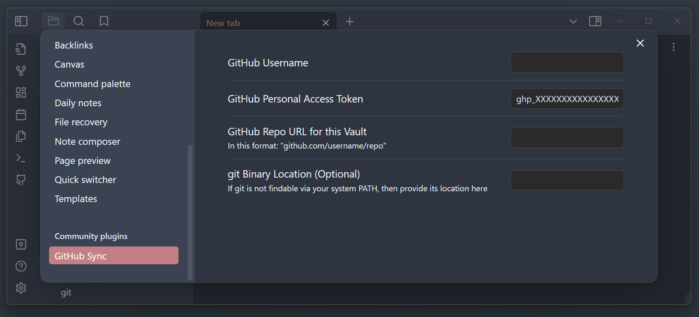

# GitHub Sync

Simple plugin that allows you to sync your vault to a personal GitHub repo for **syncing across devices**.

## How to Use
Click the **Sync with Remote** ribbon icon to pull changes from your GitHub repo and push local changes. 
If there are any conflicts, the unmerged files will be opened for you to resolve (or just push again with the unresolved conflicts - that's fine too).

## Setup
What you need:
- GitHub account
- GitHub [personal access token](https://docs.github.com/en/authentication/keeping-your-account-and-data-secure/managing-your-personal-access-tokens) from https://github.com/settings/tokens
- GitHub repo for your vault
- Git installed device

After installing the plugin, open the **GitHub Sync** section in Settings. Put in your GitHub username, personal access token, and the URL for your GitHub repo in the noted format. Make sure your PAT has control of private repos if your repo is private. That's it.

### Optional

If your git binary is not accessible from your system PATH (i.e. if you open up Command Prompt or Terminal and can't use git), you need to provide its location. I initialize git only when launching Cmder, so I need to input a custom path like so: `C:/Users/Kevin/scoop/apps/cmder-full/current/vendor/git-for-windows/cmd/git`.

I'm assuming your vault directory is already a Git repository, but if it's not you need to `git init` it first (make sure the default branch name matches what's on the GitHub repo e.g. main).
## Rationale

This plugin is for personal use, but I figured others might find it useful too. This is basically a glorified script - the code is tiny its like ~200 SLOC.
I keep a private GitHub repository for my Markdown notes, and I wanted some way to pull/push my notes from within Obsidian without opening a command line to run a script or set up an auto sync script on a timer. I don't use Git branches for my notes so this plugin doesn't support branching. 

The Node API used by this plugin works with any remote host, but I use GitHub so I centered the whole plugin around that.

Mobile support could come in the future depending on how much I need it myself.

Follow my stuff at https://kevch.in/