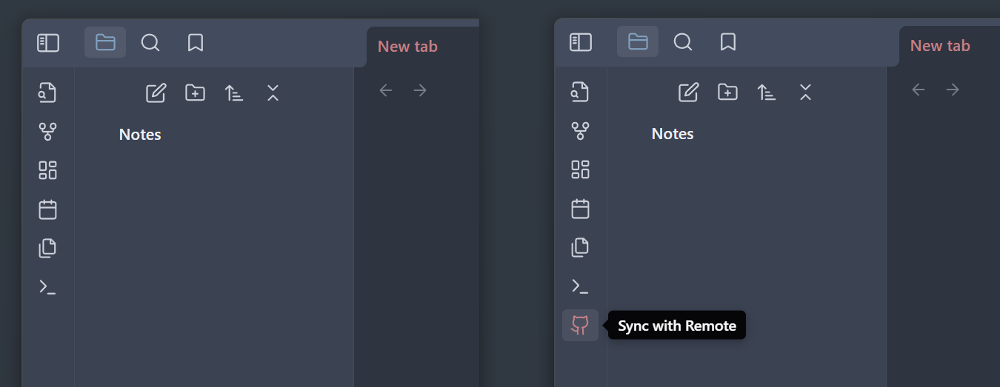
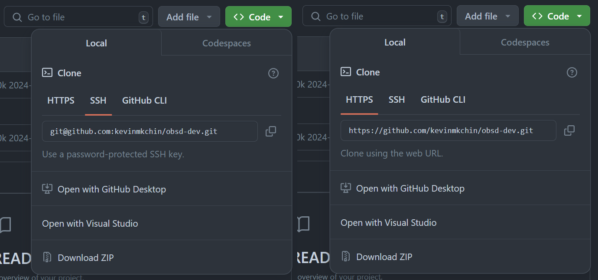
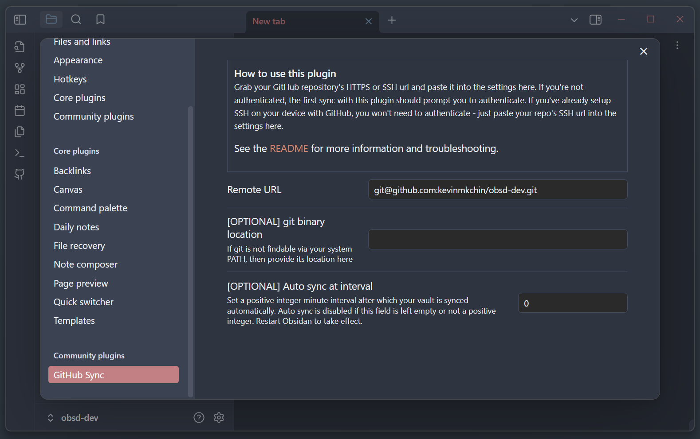

### Changelog 1.0.4
- Simplified setup process.
- Allow SSH url for remote.


# GitHub Sync

Simple plugin that allows you to sync your vault to a personal GitHub repo for **syncing across devices**.



## How to Use
Click the **Sync with Remote** ribbon icon to pull changes from your GitHub repo and push local changes. 
If there are any conflicts, the unmerged files will be opened for you to resolve (or just push again with the unresolved conflicts - that should work too).

## Setup

### Setting up a GitHub repo
If your vault is already set up as a GitHub repository, you can skip this step. Otherwise, create a new public or private GitHub repository that you want to use for your vault.

Navigate to your vault and `git init` the folder. 
At this point, add anything you don't want syncing across your devices to a `.gitignore`.

This is not required, but you should try pushing your vault to your GitHub repository before continuing to make sure you can do that in the first place before using this plugin:
```
git add .
git commit -m "my obsidian vault first commit"
git branch -M main
git remote add origin <remote-url>
git push -u origin main
```
Verify that this works before continuing.

### Setting up remote URL
All this plugin needs now is your GitHub repo's remote URL. You can grab this from the GitHub repo page for your vault:



You can use either the HTTPS or SSH url. Grab it and paste it in the GitHub Sync settings tab like so:



Done. Try clicking the Sync button now - it should work.

The first time may prompt you to authenticate if you haven't, or it may ask you to configure git with your email and name.

### Optional

If your git binary is not accessible from your system PATH (i.e. if you open up Command Prompt or Terminal and can't use git), you need to provide its location. I initialize git only when launching Cmder, so I need to input a custom path like so: `C:/Users/Kevin/scoop/apps/cmder-full/current/vendor/git-for-windows/cmd/`. Note that I excluded `git.exe` from the end of the path.

You can also include your GitHub username and personal access token in the remote url. Like so: `https://{username}:{personal access token}@github.com/{username}/{repository name}`. This is not recommended anymore, but it was how the plugin worked prior to 1.0.4. If you're doing this, you'll have to add `.obsidian/plugins/github-sync/data.json` to your `.gitignore`. See: https://github.com/kevinmkchin/Obsidian-GitHub-Sync/issues/2#issuecomment-2168384792.

## Rationale

This plugin is for personal use, but I figured others might find it useful too. This is basically a glorified script - the code is tiny its like ~200 SLOC.
I keep a private GitHub repository for my Markdown notes, and I wanted some way to pull/push my notes from within Obsidian without opening a command line to run a script or set up an auto sync script on a timer. I don't use Git branches for my notes so this plugin doesn't support branching. 

The Node API used by this plugin works with any remote host, but I use GitHub so I centered the whole plugin around that.

Mobile support could come in the future depending on how much I need it myself.

Follow my stuff at https://kevin.gd/

